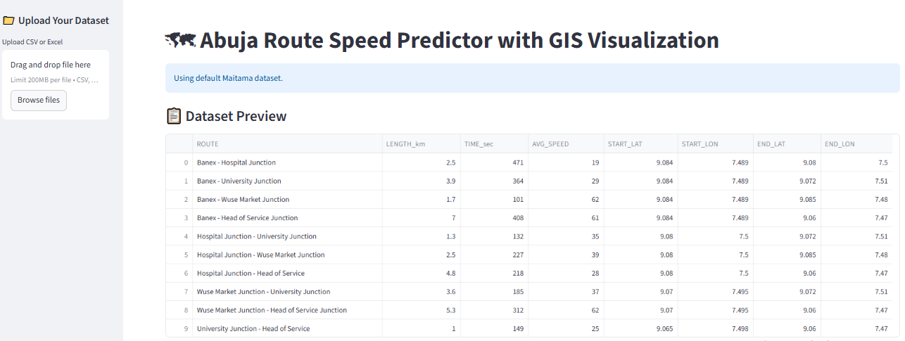
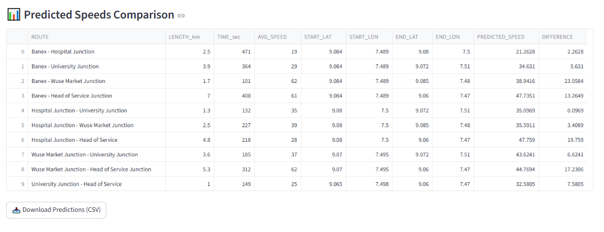

# 🗺 Abuja Route Speed Predictor with GIS Visualization

An intelligent traffic analytics web application built with **Streamlit**, **Machine Learning**, and **GIS Mapping** to predict average route speeds in Abuja, visualize road routes interactively, and support smart urban mobility planning.

🔗 **Live App:** https://kola-abuja-route.streamlit.app/

---

## 📌 Project Overview

Traffic congestion and travel delays are major challenges in fast-growing cities like Abuja. This project provides a smart solution for predicting route speeds using historical route data and visualizing traffic routes using GIS technology.

The application enables users to:

- Upload custom datasets (CSV / Excel)
- Predict average route speeds using Machine Learning
- Visualize Abuja routes on an interactive GIS map
- Evaluate model performance
- Compare predicted vs actual speeds
- Download prediction results

---

## 🚀 Features

### 📁 Dataset Upload

Users can upload:

- CSV files
- Excel files

Or use the built-in **Maitama sample dataset**.

### 🤖 Machine Learning Prediction

Uses **Linear Regression** to predict route average speed based on:

- Route Length (km)
- Travel Time (seconds)

### 📊 Model Evaluation

Displays:

- **R² Score**
- **Mean Absolute Error (MAE)**

### 🗺 GIS Route Visualization

Interactive route map powered by **PyDeck** showing:

- Route connections
- Speed-based route coloring
- Start and end route points
- Hover tooltips

### 📥 Export Results

Download route prediction results as CSV.

---

## 🖼 App Screenshots

### Dashboard



### Prediction Output



### App Summary


---

## 🛠️ Tech Stack

- Python  
- Streamlit  
- Pandas  
- Matplotlib  
- Seaborn  
- Scikit-learn  
- PyDeck  

---

## 📂 Project Structure

```bash id="9l4f1q"
Abuja-Route-Speed-Predictor-with-GIS-Visualization/
│── assets/
│   ├── App Summary.png
│   ├── Dashboard.png
│   └── Predict.png
│── Rout.py
│── requirements.txt

```
---
⚙️ Installation & Setup
1️⃣ Clone Repository
```bash
pip install -r requirements.txt
```
---
2️⃣ Install Requirements
```bash
pip install -r requirements.txt
```
---
```bash
pip install -r requirements.txt
```
---
3️⃣ Run App
```bash
streamlit run Rout.py
```
---
## 📌 Use Cases

- Smart Mobility Systems  
- Traffic Speed Forecasting  
- Urban Transport Planning  
- GIS Traffic Monitoring  
- Abuja Road Network Analysis  
- Smart City Decision Support  

## 📈 Future Improvements

- Real-time Google Maps Traffic API  
- Route Recommendation Engine  
- Congestion Hotspot Detection  
- Power BI Dashboard Version  
- Public Transport Route Optimization  
- Deep Learning Traffic Forecasting  

## 👨‍💻 Author

**Kolade Olonisakin**  
Data Scientist | Machine Learning Engineer | AI Enthusiast  

## ⭐ Support

If you like this project, kindly **star the repository** and share.


